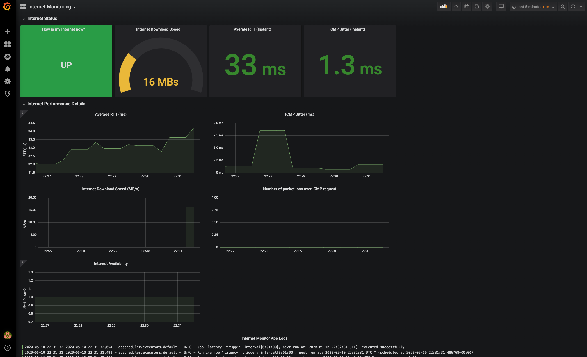

# Internet Provider Monitor

## What

This project has a simple goal of monitoring the internet provider performance: lantency and download/upload speed. Also, it is an opportunity to connect multiple technologies together and deliver an observability framework comprising of alerting, monitoring and logging (tracing will come later).

## Why

Of course you could run any speed test, or ping to detect if you network is down, but how fun is it? Also, this project will give you historical performance data for analysis.

## How

A few technologies were used:

- The core backend application (Internet Monitor - IM) was developed using Python with a job scheduler, instrumented with Prometheus metrics, that triggers jobs to test ICMP echo request latency average RTT, download/upload performance
- Prometheus /metrics endpoint was added to the code and a few custom metrics to track latency, and download/upload speed (MB/s)
- Prometheus server to scrape the data from IM
- Grafana is used to present the data and show the historical information
- Python standard logging with details about the job execution and the overall app messages
- Docker and docker-compose is used to build and run the monitor app, prometheus, grafana and alert manager
- Flake8 to check for pep8 issues
- mypy to check for type errors
- bandit to check for vulnerabilities
- pytest for unit testing
- black to format our python code
- GNU Make to facilite our development process (i.e. build, test, etc)
- cAdvisor to expose container information such as memory/cpu consumption for all containers running under docker-compose control
- Loki to show logs in grafana
- Node exporter to gather node metrics
- Alertmanager to manager alerts sent from prometheus

## Tech stack

- Python 3
- Docker
- docker-compose
- prometheus
- alertmanager
- grafana
- cAdvisor
- GNU Make
- node-exporter
- loki

### Python major libraries and tools

- flake8
- prometheus_client
- bandit
- requests
- mypy
- coverage
- pytest
- icmplib
- isort

## Running the code

### Pre-requisites

- A working docker and docker-compose
- Git to download the code

### How to run

```bash
git clone https://github.com/global/internet-monitor.git
make init
make build
make run
make urls
```

Open:

- <http://localhost:9090/> - to access prometheus
- <http://localhost:3000/> - to access grafana (login: admin / pass: admin)
  - There is a pre-configured dashboard called `Internet Monitoring`. When logged in, click to access the information
  - To visualize all the data, wait about 5 min, as this is the time the download speed job kicks in
- <http://localhost:8000/metrics> - to access the internet-monitor metrics
- <http://localhost:8080/> - to access cAdvisor (you can also access the metrics through prometheus and grafana)

This is the `Internet Monitoring` you will get when opening grafana:



## Development

## Bugs and Known Issues

- Sometimes my docker for mac stop accepting inbound ICMP traffic and I need to restart it to get  `ping` working again.

## TODO

- Create a demo video
- Integrate our alerthook with alertmanager
- Add container resources dashboard into grafana
- Integrate alertmanager with external notification services (i.e. Pagerduty, Xmatters, etc.)